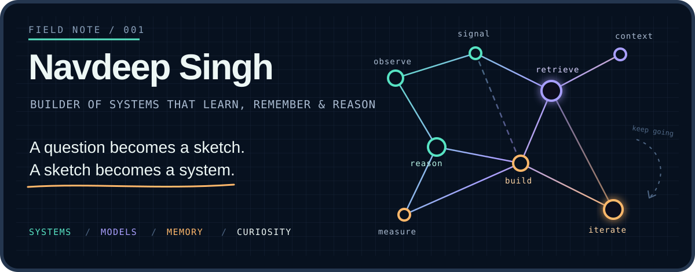

<p align="center">
  
</p>

<p align="center">
  <a href="https://nvdpsingh.github.io/Portfolio/"></a>
  &nbsp;
  <a href="https://linkedin.com/in/navdeep-singh-398494b3"></a>
  &nbsp;
  <a href="mailto:navdeepsinghdhangar@gmail.com"></a>
</p>

<p align="center">
  
</p>

<p align="center">
  <picture>
    <source media="(prefers-color-scheme: dark)" srcset="https://raw.githubusercontent.com/nvdpsingh/nvdpsingh/output/cave-runner-contribution-graph-dark.svg">
    <source media="(prefers-color-scheme: light)" srcset="https://raw.githubusercontent.com/nvdpsingh/nvdpsingh/output/cave-runner-contribution-graph.svg">
    
  </picture>
</p>

> I like the layer between a promising model and a dependable system - the part where memory, retrieval, evaluation, latency, and the person using it all begin to matter.

<details>
<summary><strong>Open the field notes</strong></summary>
<br>

Most of my repositories begin the same way: a question, a rough diagram, and a Python file with a very temporary name.

```text
observe  ->  retrieve  ->  reason  ->  build  ->  measure  ->  repeat
```

- How does memory change an agent over a long conversation?
- How can retrieval and evaluation make generative systems less mysterious?
- How capable can a small model become when it learns to use tools?
- How do you make a complicated system feel simple from the outside?

</details>

<details>
<summary><strong>Open the working set</strong></summary>
<br>

`Python` `PyTorch` `Transformers` `FastAPI` `PostgreSQL` `Redis` `Docker` `GCP` `Azure` `AWS`

I learn by building the whole path - model, data, API, infrastructure, evaluation, and the final interaction.

</details>

<p align="center">
  <sub>Bay Area, California &nbsp;/&nbsp; somewhere between a whiteboard and a terminal</sub>
</p>
